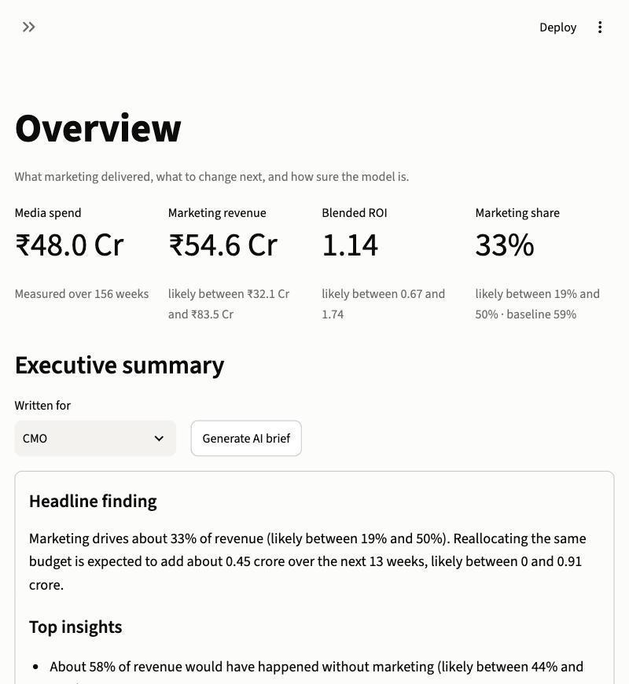
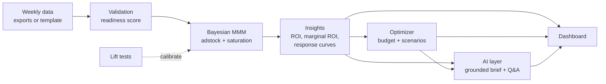

# MixLab

**A Bayesian marketing mix model that tells a CMO where the next rupee should go, how sure it
is, and when not to trust it.**

**[Open the live dashboard](https://mixlab.streamlit.app/)** (synthetic demo brands; the first load takes a minute)

[](https://mixlab.streamlit.app/)

## The problem
Most marketing budgets are steered by last-click or platform-reported attribution. That
reporting credits a sale to whatever ad was touched last, so it ignores the sales that would
have happened anyway and the ads whose effect arrives weeks later. In MixLab's synthetic
brands, a naive same-week attribution reports an ROI of about 3.5 for almost every channel,
because it hands the 59% of revenue that is baseline to whoever was spending that week. Against
the model it overstates Meta five-fold and understates email. Budgets built on those numbers
keep funding channels that are already saturated.

A marketing mix model answers the question attribution cannot: *what revenue would we have
lost without this channel?* MixLab estimates that with uncertainty, checks itself against a
known answer, and turns the result into a budget recommendation a non-technical reader can act
on.

## How it works


| Stage | Module | What it does |
|---|---|---|
| Data | `data_gen`, `onboarding` | Synthetic brands with known truth; mappers for Meta, Google Ads and Shopify exports |
| Validation | `validate` | Schema, quality and MMM-readiness checks with a score out of 100 |
| Model | `model` | PyMC-Marketing MMM with documented priors, prior predictive checks, save/load |
| Insights | `insights` | Every metric as a distribution: ROI, marginal ROI, saturation, carryover |
| Optimizer | `optimizer` | Bounded budget allocation, risk-averse objective, scenarios, budget-level curve |
| Calibration | `calibration` | Lift-test calibration and a planner for which channel to test next |
| AI layer | `ai_explainer` | Claude writes the brief and answers questions by calling the real functions; every number is checked against the inputs |
| Dashboard | `app/` | Seven-page Streamlit app over pre-fitted models |

## Headline results
All on synthetic brands where the true answer is known (`reports/evaluation_summary.json`).

| Question | Result |
|---|---|
| Does the model recover the true channel ROI? | True ROI inside the 94% range for **27 of 30** channel estimates across five seeds (90%); 5 of 6 in each demo brand |
| Does it predict weeks it has not seen? | **1.2% to 1.6% MAPE** on the most recent 12 weeks; 3% to 4% on two earlier 12-week windows of a rolling backtest |
| Is the optimizer's advice worth following? | With channel moves capped at 30%: model expects +7.4%, the truth delivers **+3.3%**. With no cap: model expects +16.4%, truth delivers **-0.1%**. The app's default adds a confidence gate (hard-to-measure channels held to 10%) and reports a realistic uplift of 40% of the expected one |
| What does one experiment buy? | A simulated 8-week lift test narrowed Google Search's ROI range by **85%** (0.02 to 4.19 became 1.33 to 1.94; truth 1.71) |
| Does it work on someone else's data? | On pymc-marketing's public dataset both documented carryover rates were recovered (0.40 and 0.19 vs. 0.4 and 0.2) |

The optimizer row is the one to read twice: the model is right about direction and wrong about
size, and unconstrained optimization chases its own errors. The dashboard says so on the Model
health page.

## Quickstart
Requires [uv](https://docs.astral.sh/uv/); it installs Python 3.11 and every dependency on
first use.

```bash
make data       # generate three synthetic brands
make validate   # check them against the data contract
make train      # fit each brand, about 5 minutes
make app        # open the dashboard
```

Optional: copy `.env.example` to `.env` and set `ANTHROPIC_API_KEY` for the AI brief and chat.
Other targets: `make test`, `make lint`, `make evaluate`, `make calibrate`.

## Tech stack
PyMC and PyMC-Marketing (model, lift-test calibration, budget optimizer), nutpie and Numba
(sampling), ArviZ, pandas, Plotly and Streamlit (dashboard), the Anthropic SDK with Claude
(explanation layer), pydantic (config and reports), pytest and ruff (156+ tests, 94% coverage,
CI on every push).

## Limitations
- **Synthetic validation only.** Recovery, holdout and optimizer results come from generated
  data. One public dataset has been run through the pipeline; no real brand has.
- **Wide ranges.** Most channel ROIs span poor to good. Only TV, with its distinctive flights,
  is pinned down without an experiment.
- **Revenue, not profit.** ROI is revenue per rupee; no margin is applied.
- **Static, independent effects.** No time-varying effectiveness and no cross-channel effects
  such as TV driving search demand.
- **Optimistic optimizer.** Expected uplift is about twice the true uplift.
- **AI layer not exercised live** in this repository's tests; it is tested against a mocked
  client.

See [docs/model_card.md](docs/model_card.md) for assumptions and failure modes.

## Roadmap
1. Fit a real brand and compare with its platform-reported numbers.
2. Profit view: margin-aware ROI and break-even.
3. Time-varying effects and a flexible trend.
4. Shrink the optimizer's expected uplift using its measured optimism.
5. Geo-level model so lift tests and the MMM share one structure.

## Using your own data
1. Fill in `templates/mmm_data_template.xlsx`, or convert platform exports:
   ```bash
   uv run python scripts/onboard.py --shopify orders.csv --meta meta.csv --google google.csv \
       --out data/processed/mmm_weekly.csv
   ```
2. Check it in the app's Upload page, then train with `scripts/train.py`.
3. If you have geo tests or conversion-lift studies, list them in the format of
   `templates/experiments_template.csv` and calibrate the model with them
   (`mixlab.calibration`).

## Data handling
- **Raw data stays local.** Everything under `data/raw/` and `.env` is gitignored. Nothing is
  uploaded anywhere by the pipeline; the app's Upload page validates a file in memory and does
  not store it.
- **Sharing data safely.** `scripts/onboard.py --anonymize` multiplies revenue and all spend
  by one secret factor derived from a passphrase in the `MIXLAB_ANON_SECRET` environment
  variable. ROI, channel shares and response shapes are unchanged, so the model's conclusions
  still hold; only absolute rupee levels are hidden. Keep the passphrase to reverse it.
- **What anonymization does not hide.** Dates, seasonality, the channel mix and relative
  sizes remain visible, and anyone who knows one true figure (say, one month's revenue) can
  recover the factor. Treat anonymized files as confidential, not public.
- **AI features.** The brief and chat send a summary of model results (not row-level data) to
  the Claude API. Leave `ANTHROPIC_API_KEY` unset to keep everything offline.

## More
[Case study](docs/case_study.md) · [Architecture](docs/architecture.md) ·
[Model card](docs/model_card.md) ·
[Deployment](docs/DEPLOY.md) · [Public dataset test](reports/public_dataset_test.md)
